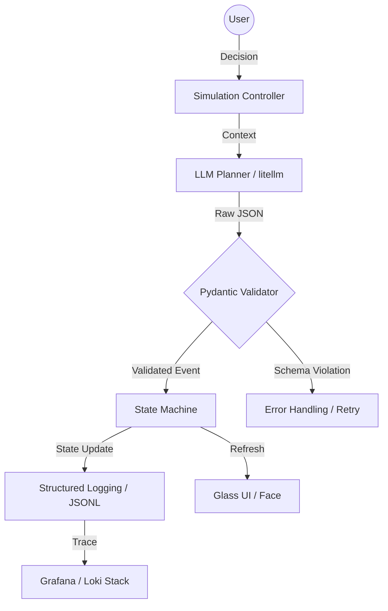

# proSIM: The Behavioral Oracle v4.0

[](https://opensource.org/licenses/MIT)
[](https://pydantic-docs.helpmanual.io/)
[](https://grafana.com/docs/loki/latest/get-started/labels/)

proSIM is a **Deterministic Behavioral Assessment Engine** designed to profile Product Management competence through high-fidelity simulation. Unlike traditional simulators, proSIM treats the user's decision-making process as a "flight stream," capturing metadata on hesitation, strategic consistency, and resilience under pressure.

## 🏗 Architecture: Planner-Executor Pattern

proSIM decouples the **Reasoning Layer (LLM)** from the **Physics Engine (State Machine)**. This ensures that while the narrative is generative, the business math remains immutable and deterministic.



## 🛠 Core Competencies

### 1. AI Reliability (Type-Safe Transitions)
We utilize **Pydantic** to enforce a strict contract between the LLM and the engine. By defining a `SimulationEvent` schema, we eliminate "hallucination" risks where an AI might suggest impossible state changes (e.g., spending more budget than available). Every narrative pulse is validated before it touches the core state.

### 2. Observability (Structured Telemetry)
The engine is "born to be observed." Every turn emits **Structured JSON Logs (JSONL)**.
* **Trace ID Context:** Every decision is tagged with a unique `trace_id`.
* **Metric Snapshots:** Logs include snapshots of the "Iron Quadrant" (Health, Trust, Morale, Score).
* **Behavioral Tracing:** We capture "How" decisions are made (Latency, Reversals) to build a competency profile.

### 3. Architectural Clarity (Headless State Machine)
The backend is a pure, headless state machine. It is 100% decoupled from the React frontend, allowing the simulation math to be unit-tested, audited, and deployed in high-concurrency environments without UI overhead.

## 🚀 Quick Start

### Prerequisites
- Python 3.12+
- Node.js 18+

### Setup
```bash
# Install backend dependencies
pip install -r requirements.txt

# Run the headless engine
python main.py
```

### Simulation Loop
The engine will boot, initialize a session, and begin emitting structured telemetry to `stdout`.